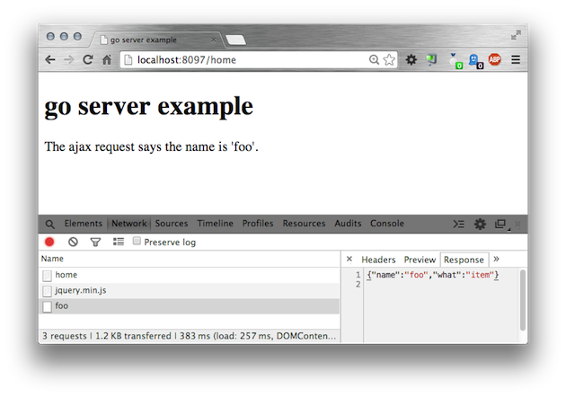

golang-webserver
================

An example of a webserver in the Go programming language,
including a jQuery ajax request .

    $ go run webserver.go
    
... and point a browser at http://localhost:8097/home
which returns an HTML webpage (home.html).

That webpage makes a 2nd GET request to http://localhost:8097/item/foo
which return a JSON response {"name":"foo","what":"item"}, 
part of which is inserted into the home page's span element.

